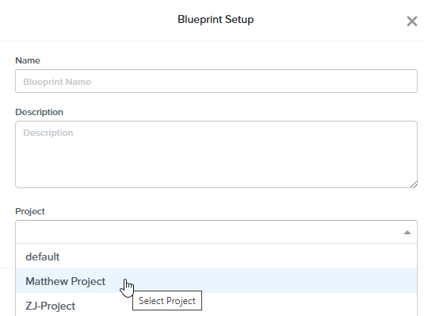
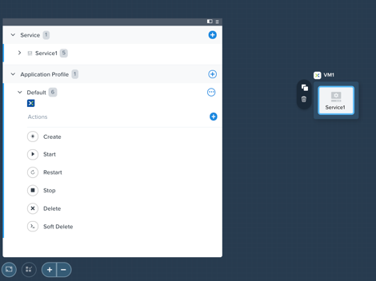
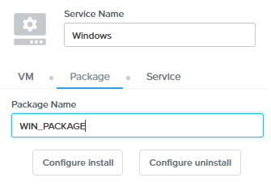
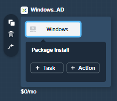
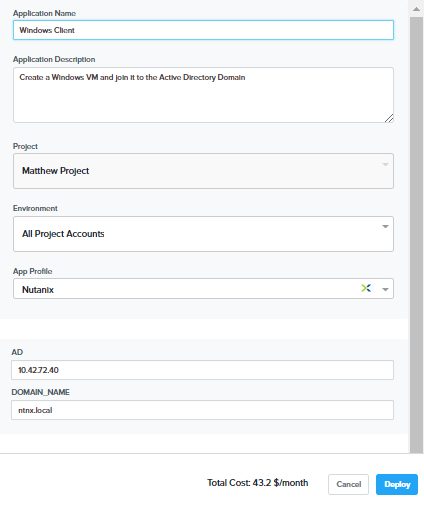
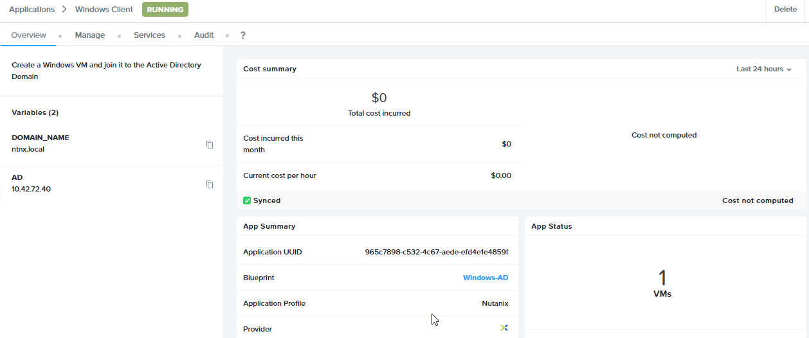
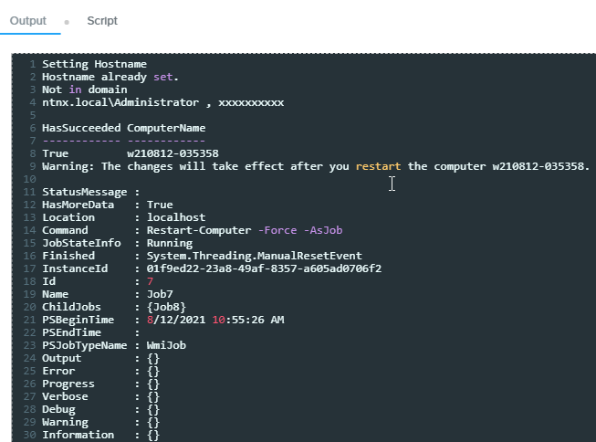
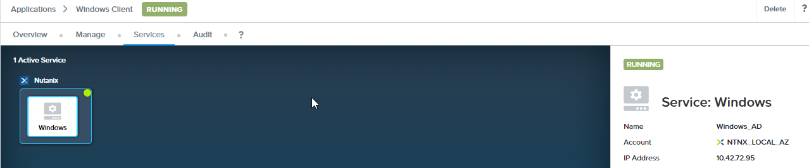
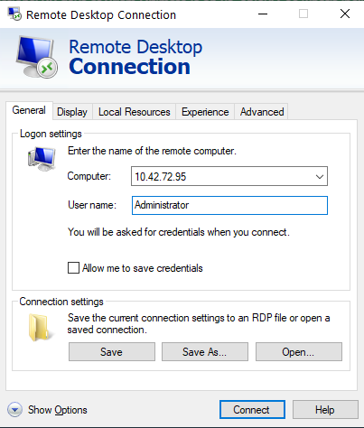
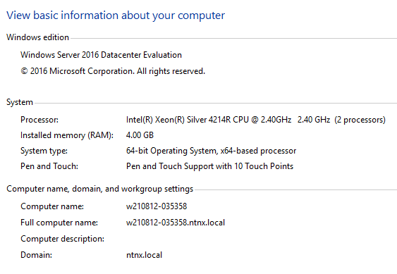

.. _calm_windows_ad:

-----------------------
Calm: Windows AD
-----------------------

Overview
++++++++

.. note::

  Estimated time to complete: **45 MINUTES**

  In this exercise you will create a Nutanix Calm Blueprint based on a Microsoft Windows 2016 image.  The image will be sysprepped with an unattended XML answer file, and then will be added to a Domain via a Powershell script.  We'll also add a script to remove the computer from the Domain upon deletion.

Creating Blueprint 
++++++++++++++++++

Creating Blueprint
..................

From **Prism Central > Calm**, select **Blueprints** from the sidebar and click **+ Create Application Blueprint**, choose **Multi VM/Pod Blueprint**.

Specify **Windows-<INITIALS>** in the **Blueprint Name** field.
Enter a **Windows 2016 added to AD** in the Description field
Select the project created earlier from the **Project** drop down menu and click **Proceed**.

Click **Credentials >** :fa:`plus-circle` and enter **both** of the following credentials:

.. note::

  You'll likely notice that both credentials have the same username and password.  For this reason, we technically could use a single credential.  However, in the real world it is extremely unlikely (and unwise) that both your User VMs and your Domain credentials are the exact same.  For that reason, we'll leave them seperate to make this Blueprint more portable.

- **Credential Name** - WIN_VM_CRED
- **Username** - Administrator
- **Secret** - Password
- **Key** - nutanix/4u

- **Credential Name** - DOMAIN_CRED
- **Username** - Administrator
- **Secret** - Password
- **Password** - nutanix/4u

.. figure:: images/windows1.png

Click **Save**, and then **Back**.

Setting Variables
.................

Variables improve the extensibility of Blueprints.  For this Blueprint, we'll want to define the domain name that the Windows VM will join to, and the IP of the Active Directory server.  We'll leave the **Secret** variables **un-checked**.

On the right side of the screen, in the **Configuration Pane** under **Variable List**, fill out the following fields:

+------------------------+------------------------------------+
| **Variable Name**      | **Value**                          |
+------------------------+------------------------------------+
| DOMAIN_NAME            | ntnx.local                         |
+------------------------+------------------------------------+
| AD                     | <DC-VM-IP> (10.42.xx.40)           |
+------------------------+------------------------------------+

.. figure:: images/windows2.png

Click **Save**.

Adding Windows Service
......................

Select **Blueprints** from the sidebar and click your ****Windows-<INITIALS>**** Blueprint to open the Blueprint Editor.

In **Application Overview > Services**, click :fa:`plus-circle`.

Note that **Service1** appears in the **Workspace** and the **Configuration Pane** reflects the configuration of the selected Service.

Fill out the following fields on the right side:

- **Service Name** - Windows
- **Name** - Windows_AD
- **Cloud** - Nutanix
- **OS** - Windows
- **VM Name** - WC@@{calm_time}@@
- **Image** - windows2016
- **Device Type** - Disk
- **Device Bus** - SCSI
- Select **Bootable**
- **vCPUs** - 2
- **Cores per vCPU** - 1
- **Memory (GiB)** - 4
- Select **Guest Customization**
- **Type** - Sysprep
- **Install Type** - Prepared
- **Script** - Paste in the following Unattended XML:

  .. code-block:: xml

     <?xml version="1.0" encoding="UTF-8"?>
     <unattend xmlns="urn:schemas-microsoft-com:unattend">
        <settings pass="specialize">
           <component xmlns:wcm="http://schemas.microsoft.com/WMIConfig/2002/State" xmlns:xsi="http://www.w3.org/2001/XMLSchema-instance" name="Microsoft-Windows-Shell-Setup" processorArchitecture="amd64" publicKeyToken="31bf3856ad364e35" language="neutral" versionScope="nonSxS">
              <ComputerName>Win-@@{calm_unique}@@</ComputerName>
              <RegisteredOrganization>Nutanix</RegisteredOrganization>
              <RegisteredOwner>Acropolis</RegisteredOwner>
              <TimeZone>UTC</TimeZone>
           </component>
           <component xmlns="" name="Microsoft-Windows-TerminalServices-LocalSessionManager" publicKeyToken="31bf3856ad364e35" language="neutral" versionScope="nonSxS" processorArchitecture="amd64">
              <fDenyTSConnections>false</fDenyTSConnections>
           </component>
           <component xmlns="" name="Microsoft-Windows-TerminalServices-RDP-WinStationExtensions" publicKeyToken="31bf3856ad364e35" language="neutral" versionScope="nonSxS" processorArchitecture="amd64">
              <UserAuthentication>0</UserAuthentication>
           </component>
           <component xmlns:wcm="http://schemas.microsoft.com/WMIConfig/2002/State" xmlns:xsi="http://www.w3.org/2001/XMLSchema-instance" name="Networking-MPSSVC-Svc" processorArchitecture="amd64" publicKeyToken="31bf3856ad364e35" language="neutral" versionScope="nonSxS">
              <FirewallGroups>
                 <FirewallGroup wcm:action="add" wcm:keyValue="RemoteDesktop">
                    <Active>true</Active>
                    <Profile>all</Profile>
                    <Group>@FirewallAPI.dll,-28752</Group>
                 </FirewallGroup>
              </FirewallGroups>
           </component>
        </settings>
        <settings pass="oobeSystem">
           <component xmlns:wcm="http://schemas.microsoft.com/WMIConfig/2002/State" xmlns:xsi="http://www.w3.org/2001/XMLSchema-instance" name="Microsoft-Windows-Shell-Setup" processorArchitecture="amd64" publicKeyToken="31bf3856ad364e35" language="neutral" versionScope="nonSxS">
              <UserAccounts>
                 <AdministratorPassword>
                    <Value>@@{WIN_VM_CRED.secret}@@</Value>
                    <PlainText>true</PlainText>
                 </AdministratorPassword>
              </UserAccounts>
              <AutoLogon>
                 <Password>
                    <Value>@@{WIN_VM_CRED.secret}@@</Value>
                    <PlainText>true</PlainText>
                 </Password>
                 <Enabled>true</Enabled>
                 <Username>Administrator</Username>
              </AutoLogon>
              <FirstLogonCommands>
                 <SynchronousCommand wcm:action="add">
                    <CommandLine>cmd.exe /c netsh firewall add portopening TCP 5985 "Port 5985"</CommandLine>
                    <Description>Win RM port open</Description>
                    <Order>1</Order>
                    <RequiresUserInput>true</RequiresUserInput>
                 </SynchronousCommand>
                 <SynchronousCommand wcm:action="add">
                    <CommandLine>powershell -Command "Enable-PSRemoting -SkipNetworkProfileCheck -Force"</CommandLine>
                    <Description>Enable PS-Remoting</Description>
                    <Order>2</Order>
                    <RequiresUserInput>true</RequiresUserInput>
                 </SynchronousCommand>
                 <SynchronousCommand wcm:action="add">
                    <CommandLine>powershell -Command "Set-ExecutionPolicy -ExecutionPolicy RemoteSigned"</CommandLine>
                    <Description>Enable Remote-Signing</Description>
                    <Order>3</Order>
                    <RequiresUserInput>false</RequiresUserInput>
                 </SynchronousCommand>
              </FirstLogonCommands>
              <OOBE>
                 <HideEULAPage>true</HideEULAPage>
                 <SkipMachineOOBE>true</SkipMachineOOBE>
              </OOBE>
           </component>
           <component xmlns:wcm="http://schemas.microsoft.com/WMIConfig/2002/State" xmlns:xsi="http://www.w3.org/2001/XMLSchema-instance" name="Microsoft-Windows-International-Core" processorArchitecture="amd64" publicKeyToken="31bf3856ad364e35" language="neutral" versionScope="nonSxS">
              <InputLocale>en-US</InputLocale>
              <SystemLocale>en-US</SystemLocale>
              <UILanguageFallback>en-us</UILanguageFallback>
              <UILanguage>en-US</UILanguage>
              <UserLocale>en-US</UserLocale>
           </component>
        </settings>
     </unattend>

  .. note::
     This Unattended XML answer file will set some basic computer information such as hostname and organization, configure the Administrator password to our WIN_VM_CRED secret, open Powershell port 5985 in the firewall, and enable remote Powershell functionality.

  .. figure:: images/windows3.png

- Select :fa:`plus-circle` under **Network Adapters (NICs)**
- **NIC 1** - Primary-IPAM
- **Credential** - Select WIN_VM_CRED and leave the rest of the fields as default

  .. figure:: images/windows4.png

Click **Save** and ensure no errors or warnings pop-up.  If they do, resolve the issue, and **Save** again.

Package Install
...............

With the Windows service icon selected in the workspace window, scroll to the top of the **Configuration Panel**, click **Package**.  Name the Package as **WIN_PACKAGE**, and then click the **Configure install** button.

On the Blueprint Canvas section, a **Package Install** field will pop up next to the Windows Service tile:

Click on the **+ Task** button, and fill out the following fields on the **Configuration Panel** on the right:

- **Name Task** - JoinDomain
- **Type** - Execute
- **Script Type** - Powershell
- **Credential** - WIN_VM_CRED

Copy and paste the following script into the **Script** field:

.. code-block:: powershell

   $HOSTNAME = "Win-@@{calm_unique}@@"
   
   function Set-Hostname{
     [CmdletBinding()]
     Param(
         [parameter(Mandatory=$true)]
         [string]$Hostname
   )
     if ($Hostname -eq  $(hostname)){
       Write-Host "Hostname already set."
     } else{
       Rename-Computer -NewName $HOSTNAME -ErrorAction Stop
     }
   }
   
   function JointoDomain {
     [CmdletBinding()]
     Param(
         [parameter(Mandatory=$true)]
         [string]$DomainName,
         [parameter(Mandatory=$false)]
         [string]$OU,
         [parameter(Mandatory=$true)]
         [string]$Username,
         [parameter(Mandatory=$true)]
         [string]$Password,
         [parameter(Mandatory=$true)]
         [string]$Server
     )
     $adapter = Get-NetAdapter | ? {$_.Status -eq "up"}
     $adapter | Set-DnsClientServerAddress -ServerAddresses $Server
   
     if ($env:computername  -eq $env:userdomain) {
       Write-Host "Not in domain"
       $adminname = "$DomainName\$Username"
       $adminpassword = ConvertTo-SecureString -asPlainText -Force -String "$Password"
       Write-Host "$adminname , $password"
       $credential = New-Object System.Management.Automation.PSCredential($adminname,$adminpassword)
       Add-computer -DomainName $DomainName -Credential $credential -force -Options JoinWithNewName,AccountCreate -PassThru -ErrorAction Stop
     } else {
        Write-Host "Already in domain"
     }
   }
   
   if ($HOSTNAME -ne $Null){
     Write-Host "Setting Hostname"
     Set-Hostname -Hostname $HOSTNAME
   }
   
   JointoDomain -DomainName "@@{DOMAIN_NAME}@@" -Username "@@{DOMAIN_CRED.username}@@" -Password "@@{DOMAIN_CRED.secret}@@" -Server "@@{AD}@@"
   
   Restart-Computer -Force -AsJob
   exit 0
   

.. note::
   Looking at the script you can see a function that sets the VM's hostname if it is not already set, a function that joins the computer to the domain specified via our macro and credentials that we set earlier, and finally restarts the user VM so the domain join takes affect.

Package Uninstall
.................

Select the Windows service icon in the workspace window again and scroll to the top of the **Configuration Panel**, click **Package**.

- **Click** - Configure Uninstall
- **Click** - + Task
- **Name Task** - RemoveDomain
- **Type** - Execute
- **Script Type** - Powershell
- **Credential** - WIN_VM_CRED

Copy and paste the following script into the **Script** field:

.. code-block:: powershell

   $HOSTNAME = "Win-@@{calm_unique}@@"
   
   function RemoveFromDomain {
     [CmdletBinding()]
     Param(
         [parameter(Mandatory=$true)]
         [string]$DomainName,
         [parameter(Mandatory=$false)]
         [string]$OU,
         [parameter(Mandatory=$true)]
         [string]$Username,
         [parameter(Mandatory=$true)]
         [string]$Password,
     )
     $adapter = Get-NetAdapter | ? {$_.Status -eq "up"}
     $adapter | Set-DnsClientServerAddress -ServerAddresses $Server
   
     $adminname = "$DomainName\$Username"
     $adminpassword = ConvertTo-SecureString -asPlainText -Force -String "$Password"
     Write-Host "$adminname , $password"
     $credential = New-Object System.Management.Automation.PSCredential($adminname,$adminpassword)
     Remove-computer -UnjoinDomaincredential $credential -PassThru -Verbose -Force
     Write-Host "Removed from domain @@{DOMAIN_NAME}@@"
   }
   
   RemoveFromDomain -DomainName "@@{DOMAIN_NAME}@@" -Username "@@{DOMAIN_CRED.username}@@" -Password "@@{DOMAIN_CRED.secret}@@"

.. note::
   This script contains a function which removes the computer from the domain, utilizing the DOMAIN_CRED credentials that we defined earlier.

Click **Save**. You will be prompted with specific errors if there are validation issues such as missing fields or unacceptable characters.

Blueprint Launch and Verification
+++++++++++++++++++++++++++++++++

Launching the Blueprint
.......................

From the toolbar at the top of the Blueprint Editor, click **Launch**.

In the **Name of the Application** field, specify a unique name (e.g. Windows-*<INITIALS>*-1).

Click **Deploy*.

You will be taken directly to the **Applications** page to monitor the provisioning of your Blueprint.

Select **Audit > Create** to view the progress of your application. You'll likely notice that the **Windows - Check Login** takes some time to complete, as not only do we have to wait for the VM to power on, we have to wait for it to get Sysprepped with our Unattended XML file.  Once the login task is complete, select the **JoinDomain** task to view the output of our domain join script.

Note the status changes to **Running** after the Blueprint has been successfully provisioned.

Verification
............

Click on the **Audit** tab. Click on **Windows - Package Install**.  Click on **Windows - JoinDomain**.  Verify the powershell script was executed successfully

Click on the **Services** tab, then select the **WindowsAD** service.  Note down the IP address.  

Open a Remote Desktop to connect to the provisioned VM.

Select the **Control Panel**.  Select **System and Security**.  Select **System**

At this point you're welcome to run the **Delete** action to clean up your application and underlying VM.  Alternatively, you could run the **Soft Delete** action, which deletes the application from Calm's point of view, but **leaves** the underlying VM(s) up and running. This is useful when the VM will be used and managed perpetually by an end user, and isn't needed to be managed by Calm.

Takeaways
+++++++++

- In addition to Linux VM management with shell scripts, Nutanix Calm can natively manage Windows VMs via Powershell and Sysprep.
- Although the labs have focused solely on either Linux or Windows, Calm also supports managing different OSes within the same blueprint.  You can even manage VMs on different clouds, all within the same blueprint.
- Calm's system defined **Soft Delete** action allows you to delete an application from Calm, without affecting the underlying VMs, which is useful for Jumpboxes and Developer workstations. 
